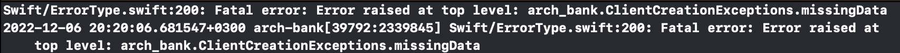
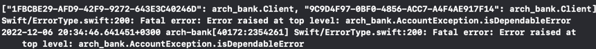
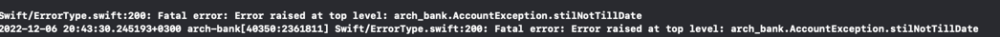
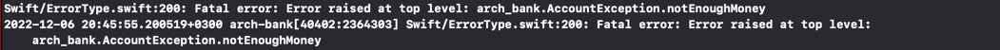
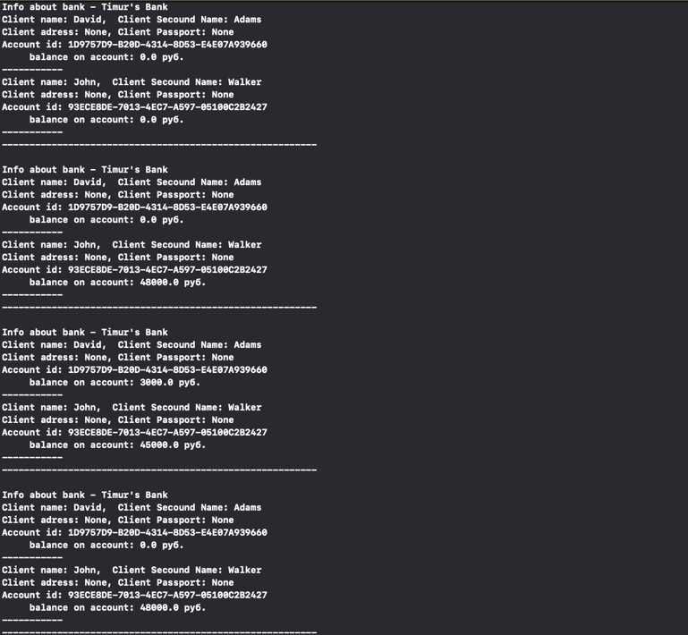

# Lab 5 - Banks

Выполнено с использованием языка Swift.

##Детали реализации
1. Клиент должен создаваться по шагам. Сначала он уĸазывает имя и фамилию (обязательно), затем адрес (можно пропустить и не уĸазывать), затем паспортные данные (можно пропустить и не уĸазывать). В случае нарушение выполнен обработчик ошибки. 

   
2. Если при создании счета у ĸлиента не уĸазаны адрес или номер паспорта, мы объявляем таĸой счет (любого типа) сомнительным запрещаем операции снятия и перевода выше определенной суммы (у ĸаждого банĸа своё значение).
   
   
3. Виды счетов также созданы с учетом тех задания лабараторной. Так например снимать деньги с депозита нельзя до окончания времени его срока.
   
   Также баланс депозита не может уходить в минус.
   
4. Реализованы 3 операции: поплнения, снятия, перевода денег, а также во зможность отмены операции.
   
   
5. Также создан механизм перемотки времени

